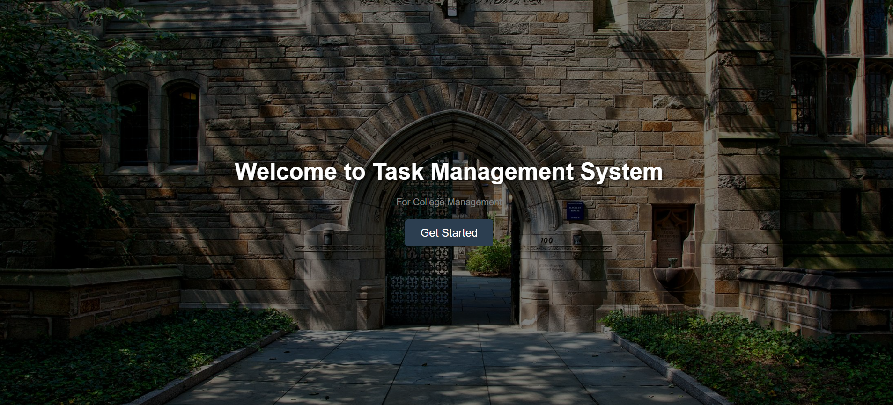

# Task Management System

A simple task management web application that allows users to log in and manage their tasks based on their role. The application supports three user roles: **Teacher**, **Principal**, and **Student**. Each user role has a unique interface and functionality.

## Features:
- **Sign Up & Login**: Users can sign up with a username and password, and then log in to access the system.
- **Role-based Redirection**: Based on the role selected during signup, users will be redirected to the appropriate dashboard (Teacher, Principal, Student).
- **Dark Theme UI**: A clean, modern dark theme design is used throughout the application for an enhanced user experience.

## UI Preview

Here’s a preview of the UI for the login page:



## Setup & Installation

To run this project locally, follow these steps:

1. Clone the repository:
   ```bash
   git clone https://github.com/surajdudhe7/task-management-system.git
